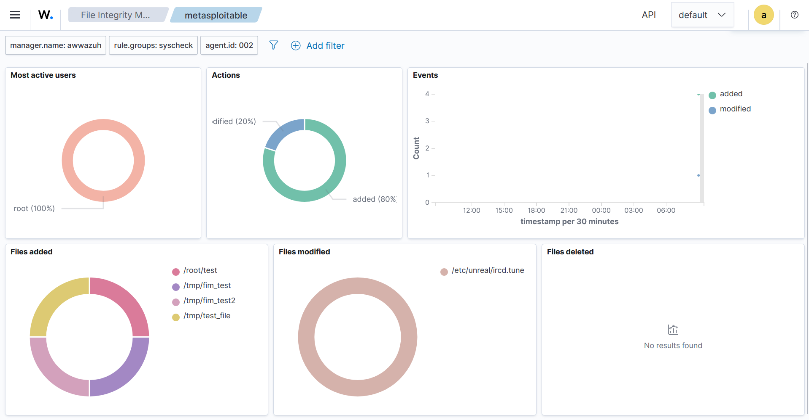

# Detection: File Integrity Monitoring (FIM)

## Overview
Wazuh's File Integrity Monitoring was configured on Metasploitable 2 to detect unauthorized file changes. Post-exploitation file activity performed via a Meterpreter session was successfully detected and attributed to the root user.

---

## Configuration

FIM was configured on Metasploitable 2 by editing `/var/ossec/etc/ossec.conf`:

```xml
<syscheck>
  <frequency>300</frequency>
  <directories check_all="yes">/etc/passwd</directories>
  <directories check_all="yes">/etc/shadow</directories>
  <directories check_all="yes">/tmp</directories>
  <directories check_all="yes">/root</directories>
  <directories check_all="yes">/bin</directories>
</syscheck>
```

A manual FIM scan was triggered from the Wazuh server:

```bash
sudo /var/ossec/bin/agent_control -r -u 002
```

---

## Files Detected

### Files Added
| File | Significance |
|---|---|
| `/root/test` | File created in root home directory via Meterpreter — high severity |
| `/tmp/hacked_by_kali` | Attacker staging file created in /tmp |
| `/tmp/fim_test` | Test file created via Meterpreter shell |
| `/tmp/fim_test2` | Test file created via Meterpreter shell |

### Files Modified
| File | Significance |
|---|---|
| `/etc/unreal/ircd.tune` | Config file modified — detected automatically by Wazuh |

---

## Key Statistics

- **Most Active User:** root (100%) — all changes attributed to root access gained via exploit
- **Actions:** 80% files added, 20% files modified
- **Detection Method:** Baseline comparison between FIM scans

---

## Screenshot



---

## Key Takeaway

FIM successfully tracked every file created during the post-exploitation phase of the Meterpreter session. The fact that all activity was attributed to `root` is a critical indicator — in a real environment, unexpected root-level file creation in `/tmp` and `/root` would be an immediate red flag requiring investigation.
