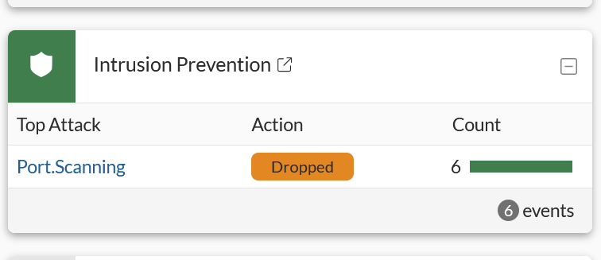
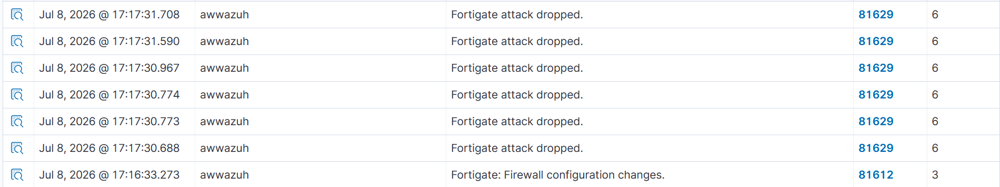

# Attack: Network Port Scan — FortiWifi IPS Detection & Blocking

## Overview
An nmap port scan was performed from Kali Linux against an external target. The FortiWifi 71G IPS engine detected the scan and after configuring a block rule, actively dropped all subsequent scan packets. Wazuh received and alerted on both the detection and the blocking in real time.

---

## Attack Details

| Field | Value |
|---|---|
| Attacker | Kali Linux (10.1.1.8) |
| Target | 8.8.8.8 (Google DNS) |
| Tool | Nmap |
| MITRE ATT&CK Tactic | Discovery |
| MITRE ATT&CK Technique | T1046 — Network Service Discovery |
| Detection Layer | FortiWifi 71G IPS (network perimeter) |

---

## Commands Used

**Initial scan (detected):**
```bash
nmap -sV 8.8.8.8
```

**Louder scan (dropped):**
```bash
nmap -sS -p 1-1000 8.8.8.8
```

---

## Phase 1 — Detection Only

Before configuring the block rule the FortiWifi IPS detected the scan but allowed it through:

**Wazuh Rule 81628 (level 11) — Fortigate attack detected**
```
attack: Port.Scanning
srcip: 10.1.1.8 (Kali Linux)
dstip: 8.8.8.8
direction: outgoing
action: detected
severity: low
attackid: 43814
ref: http://www.fortinet.com/ids/VID43814
```

---

## FortiWifi IPS Block Configuration

After confirming detection was working, the IPS was configured to actively block port scanning:

1. Go to **Security Profiles → Intrusion Prevention**
2. Edit the IPS sensor applied to the Wifi firewall policy
3. Click **+ Create New** under IPS Signatures and Filters
4. Set:
   - **Type:** Signature
   - **Signature:** Port.Scanning
   - **Action:** Block
   - **Packet Logging:** Enable
5. Apply the updated IPS profile to the Wifi firewall policy
6. Click **OK**

---

## Phase 2 — Active Blocking

After configuring the block rule subsequent nmap scans were actively dropped:

**Wazuh Rule 81629 (level 6) — Fortigate attack dropped**
```
attack: Port.Scanning
srcip: 10.1.1.8 (Kali Linux)
dstip: 8.8.8.8
direction: outgoing
action: dropped
```

- **6 packets dropped** in a single scan attempt
- FortiWifi Intrusion Prevention dashboard confirmed **Dropped** status
- Wazuh alerted on every dropped packet in real time

---

## Bonus — Firewall Configuration Change Logged

**Wazuh Rule 81612 (level 3) — Fortigate: Firewall configuration changes**

Wazuh automatically logged the IPS policy change made in the FortiWifi dashboard — demonstrating that even administrative changes to the firewall are tracked by the SIEM.

---

## Dual Layer Detection

This attack was detected at two separate layers simultaneously:

| Layer | Tool | Detection |
|---|---|---|
| Network perimeter | FortiWifi 71G IPS | Port.Scanning signature fired, packets dropped |
| Endpoint | Wazuh agent on Kali | Activity logged from host perspective |

This replicates how enterprise defense in depth works — multiple detection layers catching the same threat from different angles.

---

## Compliance Mapping

FortiWifi IPS alerts are automatically mapped to compliance frameworks by Wazuh:

| Framework | Control |
|---|---|
| PCI DSS | 10.6.1 |
| GDPR | IV.35.7.d |
| HIPAA | 164.312.b |
| NIST-800-53 | AU.6 |

---

## Screenshots




---

## Key Takeaway

This demonstrates a complete network-level attack prevention cycle — from initial detection to active blocking. The FortiWifi IPS and Wazuh work together to provide both visibility and automated prevention at the network perimeter, which is exactly how enterprise security operations centers protect their networks.
