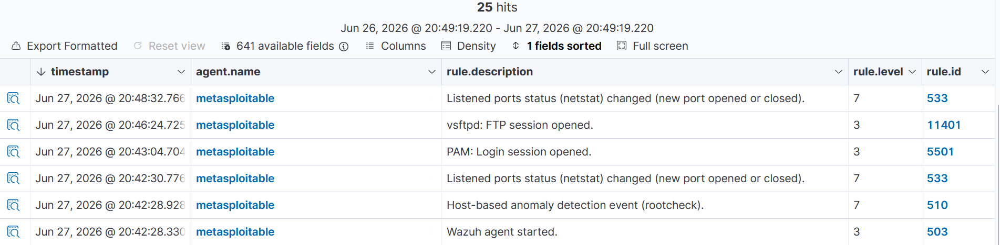

# Attack: Network Reconnaissance (Nmap)

## Overview
An aggressive Nmap scan was performed from Kali Linux against Metasploitable 2 to enumerate open ports, running services, and the operating system. Wazuh detected the scan across multiple rule categories. A separate external nmap scan was also detected and blocked by the FortiWifi 71G IPS at the network perimeter level.

---

## Attack Details

| Field | Value |
|---|---|
| Attacker | Kali Linux (10.1.1.8) |
| Target (internal) | Metasploitable 2 (10.1.1.5) |
| Target (external) | 8.8.8.8 (Google DNS) |
| Tool | Nmap |
| MITRE ATT&CK Tactic | Discovery |
| MITRE ATT&CK Technique | T1046 — Network Service Discovery |

---

## Commands Used

**Internal scan against Metasploitable:**
```bash
nmap -A -sV -O 10.1.1.5
```

**External scan (detected and blocked by FortiWifi):**
```bash
nmap -sS -p 1-1000 8.8.8.8
```

**Flags explained:**
- `-A` — Aggressive scan (OS detection, version detection, script scanning)
- `-sV` — Service version detection
- `-O` — OS fingerprinting
- `-sS` — SYN stealth scan

---

## Detection Layer 1 — Wazuh Endpoint Agent (Internal Scan)

The nmap scan against Metasploitable was detected by the Wazuh agent running on Metasploitable:

| Rule ID | Level | Description |
|---|---|---|
| 2551 | 10 | Connection to rshd from unprivileged port — possible network scan |
| 5706 | 6 | sshd: insecure connection attempt (scan) |
| 31101 | 5 | Web server 400 error code |
| 5602 | 3 | telnetd: Remote host established a telnet connection |
| 11401 | 3 | vsftpd: FTP session opened |
| 11201 | 3 | ProFTPD: FTP session opened |

---

## Detection Layer 2 — FortiWifi IPS (External Scan)

The nmap scan against an external target was detected and blocked by the FortiWifi 71G IPS engine:

| Rule ID | Level | Description |
|---|---|---|
| 81628 | 11 | Fortigate attack detected (initial scan) |
| 81629 | 6 | Fortigate attack dropped (after block rule configured) |
| 81612 | 3 | Fortigate firewall configuration change logged |

**6 packets dropped** by FortiWifi IPS in a single scan attempt.

---

## Dual Layer Detection Summary

| Scan Target | Detection Layer | Tool | Action |
|---|---|---|---|
| 10.1.1.5 (Metasploitable) | Endpoint (Wazuh agent) | Wazuh rules | Alerted |
| 8.8.8.8 (External) | Network perimeter (FortiWifi IPS) | IPS signature | Blocked & Alerted |

---

## Screenshots




---

## Key Takeaway

Nmap reconnaissance was detected at two separate layers — the Wazuh endpoint agent caught the internal scan while the FortiWifi IPS caught and blocked the external scan. This demonstrates how defense in depth provides visibility regardless of where the attacker directs their reconnaissance.
