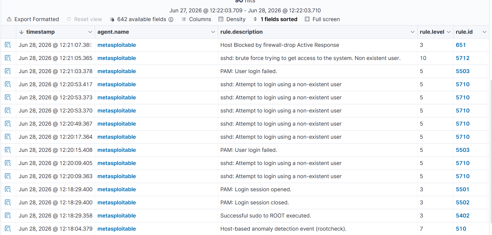

# Attack: SSH Brute Force

## Overview
A brute force attack was performed from Kali Linux against Metasploitable 2 by repeatedly attempting SSH logins with a non-existent user. Wazuh detected the attack and automatically blocked the attacking IP using Active Response.

---

## Attack Details

| Field | Value |
|---|---|
| Attacker | Kali Linux (10.1.1.8) |
| Target | Metasploitable 2 (10.1.1.5) |
| Tool | SSH (native Linux command) |
| MITRE ATT&CK Tactic | Credential Access |
| MITRE ATT&CK Technique | T1110 — Brute Force |

---

## Command Used

```bash
for i in {1..20}; do ssh -o "KexAlgorithms=diffie-hellman-group1-sha1" -o "HostKeyAlgorithms=ssh-rsa" -o "MACs=hmac-sha1" wronguser@10.1.1.5; done
```

> Note: Legacy SSH flags are required because Metasploitable 2 runs an old OpenSSH version that only supports deprecated algorithms.

---

## Wazuh Detections

| Rule ID | Level | Description |
|---|---|---|
| 5710 | 5 | sshd: Attempt to login using a non-existent user |
| 5503 | 5 | PAM: User login failed |
| 5712 | 10 | sshd: brute force trying to get access to the system |
| 651 | 3 | Host Blocked by firewall-drop Active Response |

---

## Active Response

After rule 5712 fired, Wazuh automatically triggered the `firewall-drop` active response which blocked Kali's IP (`10.1.1.8`) on Metasploitable for 180 seconds. This demonstrates automated incident response with no manual intervention required.

---

## Screenshot



---

## Key Takeaway

This demonstrates the full attack → detect → respond cycle. Wazuh not only detected the brute force attack but automatically blocked the attacker, replicating how a real SOC automated response system works.
